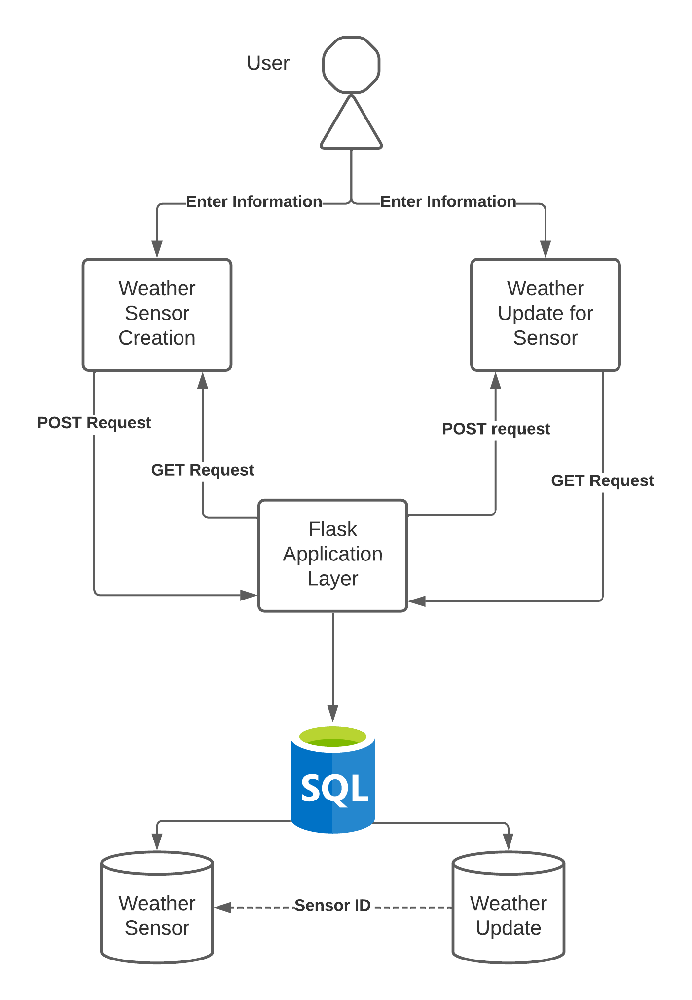

# Rainy Day

## Project Description:
A web application created with python and flask. Database and querying created and controlled by SQLAlchemy.

UI in very basic HTML & CSS. This was to make visualisations easier.

## How to run:
if required, pip install the following using:
```pip install -r requirements.txt ```

the database already contains some dummy data, including sensors and weather data attached to those sensors. 

to add sensors, give it a name, a country and a city location. 

to update a sensor, click on any sensor to add a weather update to that sensor.

you can then see all weather updates in question and can add a temperature and humidity.

by default when adding a new weather update, it will grab the current time.

queries can be used from the command line, this can be done by running the following:
1. ```python.exe ```<br>
2. ```from app import db ```<br>
3. ```from app import Sensor, WeatherData```<br>
4. ```from datetime import datetime```<br>
5. ```from from sqlalchemy.sql import func```<br>

Func can be used to express averages and means for data such as temperature and humidity. 

Queries can then be used by following the documentation at: 
[Select, Insert, Delete — Flask-SQLAlchemy Documentation (2.x) (palletsprojects.com)](https://flask-sqlalchemy.palletsprojects.com/en/2.x/queries/#querying-records)

Example queries:
```WeatherUpdate.query.order_by(WeatherUpdate.id).all()```

Retrieves all weather updates, this will include Associated Sensor id, the temperature and the humidity.

````WeatherUpdate.query.filter(WeatherUpdate.date_created > date(2021, 1, 1)).count````

This will find the number weather updates that took place after the 1st of January 2021. 

## Features 

A basic UI allowing Registration of Sensor with a name, a country and a city through an API call. 

A basic UI to view weather updates and update individual sensor weather information through an API call. 

## Data Flow Diagram



### Features I would include

I created a basic UI for a searching weather information based on certain parameters but time constraints led me 
to leaving this implementation. Queries are then completed through the terminal. 

I Would have also liked to create a much more appealing UI with a frontend framework but as this wasn't necessary, the UI presented was sufficient. 
## Challenges I encountered
This was my first time using flask and sqlalchemy so it was very much a learning on the job process.
If I had more time I would take a much more measured approach to database design with a more
Elegant implementation but for a first effort it was a great learning experience.

